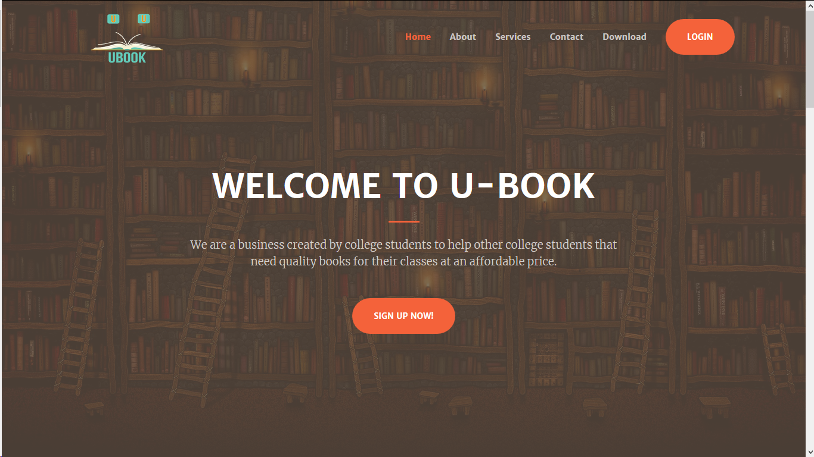
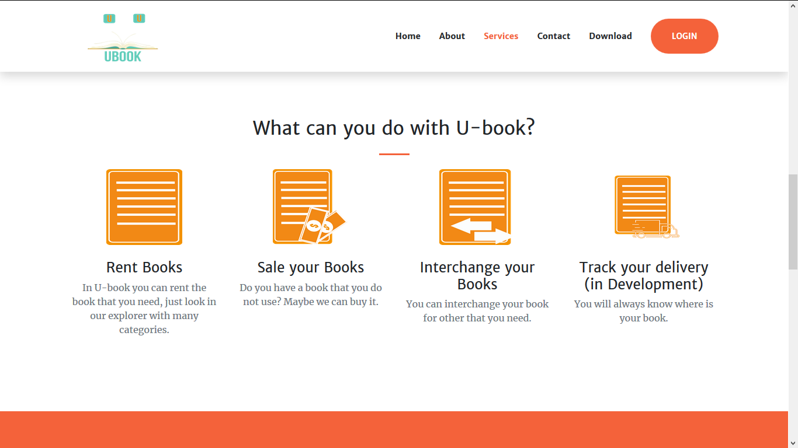
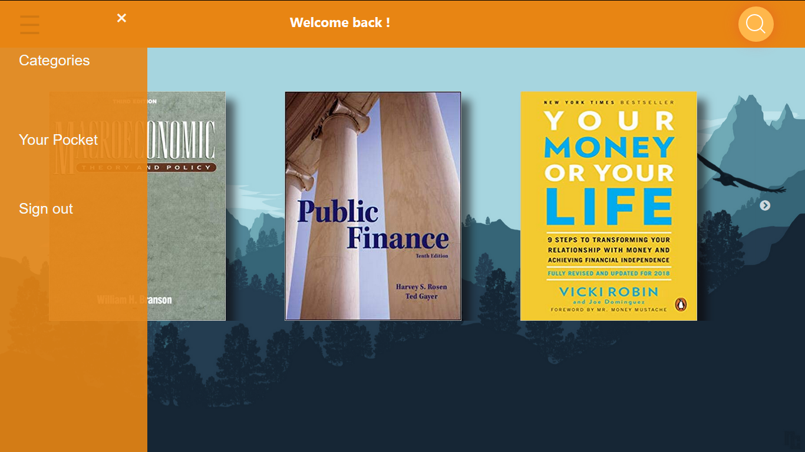

# U-book

This is fully educational repository. It contains a simulation about a fictional service for book renting.
You can  use the content, desing and scripts if you need it.

# Languages & Tags used:
 
 1.PHP  
 2.HTML5  
 3.CSS3  
 4.Boootstrap  
 5.javascript  
 
 # Previews:
 

  Home Page

  
  
  
  
